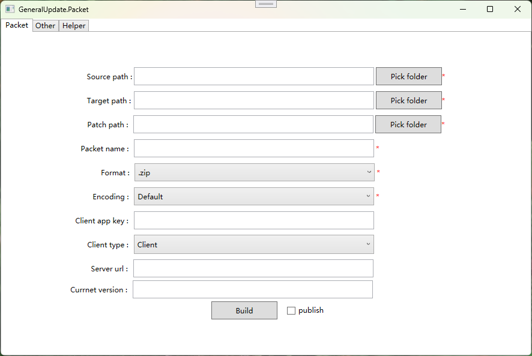

# GeneralUpdate.Tools

Generalupdate.tool is a subsidiary project of GeneralUpdate, based on. NET 8 WPF writing. Helps you generate differential patch packs and OSS version profiles. Everyone is welcome to submit issues and PR.

| function                         | Supported or not | note                                                         |
| -------------------------------- | ---------------- | ------------------------------------------------------------ |
| Version file template generation | yes              | This file is used for OSS functions and configuration of file templates that update version information. |
| Upload the update package file   | yes              | Click the build button to upload the update package to the file server by default and insert a version information record. |
| Build the update package         | yes              | Generate a differential patch update package.                |

## Open source address

- https://github.com/GeneralLibrary/GeneralUpdate.Tools
- https://gitee.com/GeneralLibrary/GeneralUpdate.Tools

## The parent project

- https://gitee.com/GeneralLibrary/GeneralUpdate.Tools
- https://github.com/GeneralLibrary/GeneralUpdate

## Run

